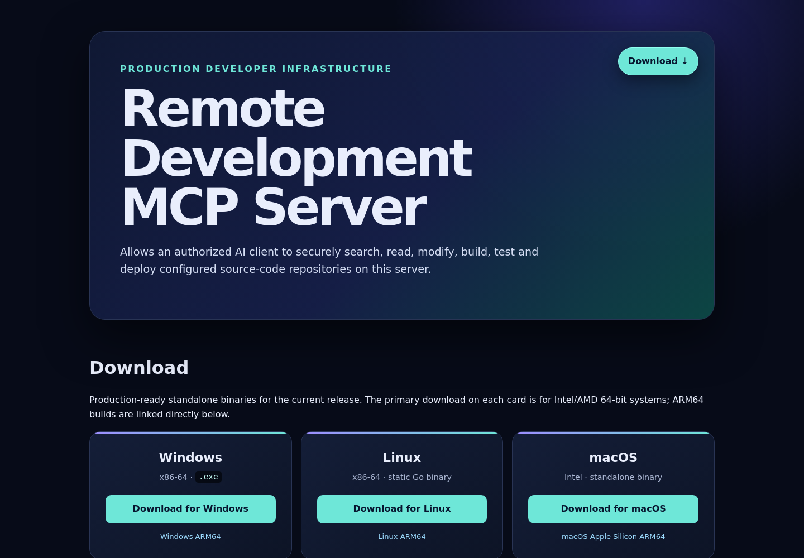
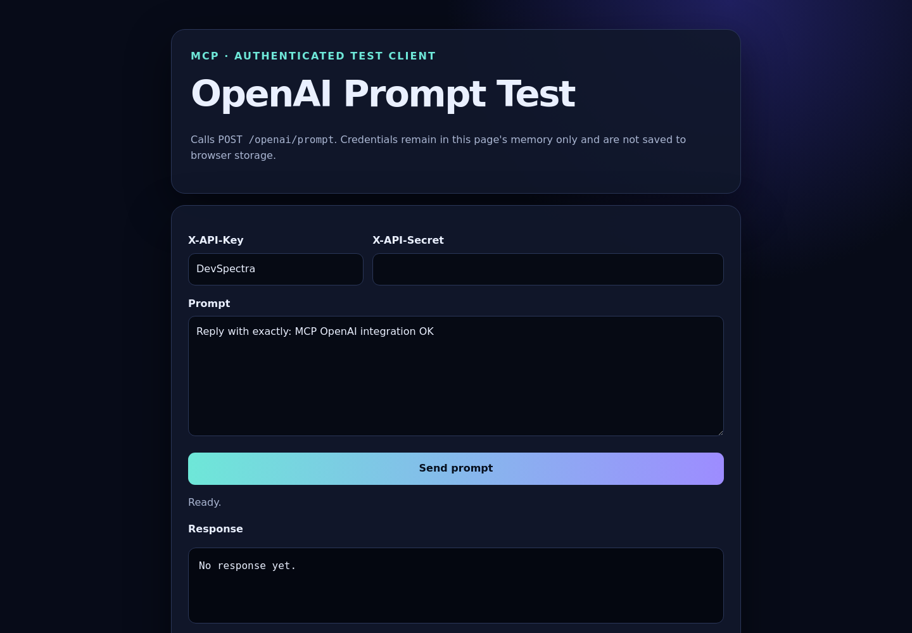

# Remote Development MCP Server

A production Go MCP server that gives an authenticated AI client bounded tools for exploring and operating configured source-code repositories on this VPS.

<p align="center">
  <strong>A production Go server that lets an authorized AI safely search, read,
  edit, build, test, version, and deploy selected repositories.</strong>
</p>

<p align="center">
  <a href="https://github.com/scriptmaster/mcp/actions/workflows/ci.yml"></a>
  
  
  
  
</p>

<p align="center">
  <a href="https://mcp.ai.msheriff.com/"><strong>Live homepage</strong></a> ·
  <a href="https://mcp.ai.msheriff.com/health">Health JSON</a> ·
  <a href="https://mcp.ai.msheriff.com/test">AI test console</a> ·
  <a href="docs/SECURITY_REVIEW.md">Security review</a>
</p>

<p align="center">
  <a href="https://mcp.ai.msheriff.com/"></a>
  <a href="https://mcp.ai.msheriff.com/test"></a>
</p>

> [!IMPORTANT]
> The pages above are public documentation and a credential-empty test form.
> Repository tools and `POST /openai/prompt` remain authenticated. No bearer
> token, upstream provider key, private repository, certificate key, or API secret is
> stored in this public repository or visible in either screenshot.

## Why this project is trustworthy

| Evidence | What it means |
|---|---|
| [Live HTTPS health](https://mcp.ai.msheriff.com/health) | The production service publicly reports its health, version, uptime, and transport—never secrets. |
| [Passing security workflow](https://github.com/scriptmaster/mcp/actions/workflows/ci.yml) | Every push and pull request runs race-enabled tests, `go vet`, `govulncheck`, and `gosec`; the workflow also runs weekly. |
| [Published security review](docs/SECURITY_REVIEW.md) | Documents the checks performed, protections implemented, and remaining operator risks without pretending any software is infallible. |
| Go 1.26.8 | The release is built with the patched toolchain verified by `govulncheck`. |
| Dedicated Linux user | Production runs as unprivileged `mcp`, not root, with extensive systemd hardening. |
| Bounded tools | There is no arbitrary shell-string endpoint; paths, command names, sizes, output, and timeouts are constrained. |
| Server-side provider key | The OpenAI or Gemini key stays in a root-owned environment file and is never sent to browser code or written to logs. |
| Reproducible deployment | Tests, build, atomic installation, systemd restart, HTTPS health check, and rollback are automated. |

The latest publication checks passed: all Go tests and race checks, `go vet`,
`govulncheck` with **no known reachable vulnerabilities**, `gosec` with
**zero unreviewed findings**, shell syntax validation, a redacted live-secret
comparison, and an HTTPS production health check.

## Start here

This repository is the readable source for the service running at
`mcp.ai.msheriff.com`. In plain English, it lets an authorized AI assistant
look at selected code folders, make controlled changes, run tests, use Git, and
request a deployment. It also includes a small authenticated provider-configurable AI prompt API.

If you are new to Go, read these in order:

1. [Beginner code walkthrough](docs/CODE_WALKTHROUGH.md) — every source file
   and every continuous line range explained in plain language.
2. [Security review](docs/SECURITY_REVIEW.md) — protections, scan results, and
   risks that an operator still needs to manage.
3. `config.example.yaml` — the settings you copy and adapt for your server.

The same complete explanation is now also embedded in
[this README](#repository-size-and-every-line-explained), so LinkedIn and
GitHub visitors do not need to leave the main page.

In plain English, this server gives an approved AI client a carefully limited
toolbox for selected source-code folders. The client can discover relevant
files without loading an entire repository, make targeted changes, review the
diff, run builds/tests, and perform separately authorized Git or deployment
operations. A second authenticated endpoint provides a small server-side
AI provider bridge for frontends that cannot call OpenAI directly.

Clone it with:

```bash
git clone https://github.com/scriptmaster/mcp.git
cd mcp
go test ./...
```

Compiled binaries and real secrets are deliberately not stored in GitHub.
The GitHub repository is public, but the running MCP and AI endpoints remain
authenticated.

Repository summary:

- **45 tracked files:** 43 readable source/configuration/documentation files
  plus 2 real website screenshots.
- **5,246 readable lines** at this revision.
- Every executable Go, JavaScript, shell, build, service, proxy, and CI line is
  explained below by continuous line ranges.
- Compiled binaries and real secrets are deliberately excluded from Git.

Production URLs:

- Homepage/operator manual: `https://mcp.ai.msheriff.com/`
- Health: `https://mcp.ai.msheriff.com/health`
- MCP: `https://mcp.ai.msheriff.com/mcp`
- AI prompt API: `https://mcp.ai.msheriff.com/openai/prompt`
- AI browser test: `https://mcp.ai.msheriff.com/test`

## Architecture

```text
MCP client
   │ HTTPS + Authorization: Bearer <token>
   ▼
NGINX :443
   │ localhost HTTP
   ▼
mcp.service → /var/www/mcp/production/mcp-server
   │ validates configured workspace + relative path + symlinks
   ▼
configured repository → bounded file/search/git/command/deploy operations
```

The source tree and production artifacts are separate:

```text
/var/www/mcp/                 source
/var/www/mcp/production/      deployed binary, config, and web assets
/etc/mcp/mcp.env              protected bearer token
/etc/systemd/system/mcp.service
/etc/nginx/sites-available/mcp.ai.msheriff.com.conf
```

## Transport and protocol

The server implements **stateless Streamable HTTP** at `POST /mcp`, not the obsolete SSE-only transport. It targets MCP protocol revision `2026-07-28`, including deterministic tool discovery and complete-result fields, and negotiates initialization compatibility with `2025-11-25`, `2025-06-18`, and `2025-03-26` clients. It validates `Mcp-Method` and `Mcp-Name` whenever clients supply the current routing headers. The service returns JSON responses directly; `GET /mcp` returns `405` because this server does not emit server-initiated notifications.

The choice follows the current [MCP Streamable HTTP specification](https://modelcontextprotocol.io/specification/2026-07-28/basic/transports) and OpenAI's [MCP and connectors guide](https://developers.openai.com/api/docs/guides/tools-connectors-mcp), which supports remote Streamable HTTP MCP servers.

## Security model

- Every request to `/mcp` requires `Authorization: Bearer <TOKEN>`; `/` and `/health` are public.
- Token comparisons are constant-time. Tokens are generated with OpenSSL, stored in `/etc/mcp/mcp.env` with mode `0600`, never accepted in URLs, and never logged.
- Only configured, enabled workspaces exist from the client's perspective. Server filesystem paths are not returned by `workspace_list`.
- All paths must be relative, remain within the selected workspace after symlink resolution, and avoid protected/sensitive names. Absolute paths, `../`, symlink escapes, `.env`, keys, certificates, and configured protected paths are rejected.
- File reads, writes, search results, requests, stdout, stderr, and timeouts are bounded.
- Replacement writes require the current SHA-256. Patches require an exact unique old-text match. Deletes require SHA-256 and only affect regular files.
- There is no arbitrary shell-string MCP tool. `run_command` accepts only administrator-configured names mapped to argv arrays. Command children receive a scrubbed environment without `MCP_TOKEN`.
- Git force push, hard reset, branch deletion, and history rewriting are not implemented. Pull is fast-forward only. Push and deploy are separate explicit calls.
- The systemd service uses a dedicated `mcp` user, no capabilities, `NoNewPrivileges`, filesystem protection, private temporary storage, restricted address families, and inaccessible `/root`, SSH, certificate, and shadow paths.
- Browser `Origin` values are allowlisted; server-to-server requests without `Origin` are accepted.
- `POST /openai/prompt` has separate `X-API-Key` and `X-API-Secret` authentication, a request-size limit, an output-token limit, a timeout, and a per-minute request limit. The selected OpenAI or Gemini key remains server-side and is never returned or logged.

This is a powerful repository automation service. Configure only repositories you intend an AI client to access, use a dedicated OS user, keep high-impact ChatGPT actions approval-gated, and audit `journalctl -u mcp`.

## Configuration

The installed configuration is `production/config/config.yaml`; it is created
from `config.example.yaml` during server setup and is not included in the
public repository. Secrets are always supplied through the environment:

```yaml
server:
  listen: "127.0.0.1:8095"
security:
  token: "FROM_ENVIRONMENT"
openai:
  enabled: true
  provider: "openai" # or "gemini"
  model: "gpt-6-luna" # use "gemini-flash-latest" with Gemini
  api_key: "FROM_ENVIRONMENT"
  client_key: "FROM_ENVIRONMENT"
  client_secret: "FROM_ENVIRONMENT"
  allowed_origins:
    - "https://mcp.ai.msheriff.com"
    - "https://*.app.ai.msheriff.com"
  max_prompt_bytes: 16384
  max_output_tokens: 1200
  timeout_seconds: 90
  requests_per_minute: 30
commands:
  build: true
  test: true
  git: true
  deploy: true
  run: true
workspaces:
  - name: example
    path: /var/www/example
    enabled: true
    read_only: false
    protected_paths: [production, .secrets]
    build:
      command: ["make", "build"]
      timeout: 300
    test:
      command: ["make", "test"]
      timeout: 300
    deploy:
      command: "./deploy.sh"
      timeout: 600
    run_commands:
      lint:
        command: ["make", "lint"]
        timeout: 180
```

Command lists execute directly without a shell. A simple scalar such as `./deploy.sh` is also accepted and split into argv; use a YAML list for arguments or values containing spaces. A workspace can be disabled with `enabled: false` or made inspection-only with `read_only: true`.

## AI prompt API

`POST /openai/prompt` validates the DevSpectra client headers and sends only the supplied prompt to the configured OpenAI or Gemini provider. It accepts:

```json
{"prompt":"Reply with exactly: MCP AI integration OK"}
```

Required headers are `Content-Type: application/json`, `X-API-Key`, and `X-API-Secret`. Successful responses contain `response_id`, `provider`, `model`, `text`, `request_id`, `usage`, and `duration_ms`. The API secret and selected upstream provider key are loaded only from `/etc/mcp/mcp.env`; neither is committed to source or shown on the public documentation page.

The manual browser client at `GET /test` stores both entered credentials in that browser’s local storage after a successful request. It provides a clear button and is suitable only for an owner on a trusted device. `GET /openai/test` permanently redirects to `/test`, while `/test/` remains unmatched. A production browser bundle must not embed the shared secret because end users can extract browser-delivered credentials; DevSpectra should call `POST /openai/prompt` from its own backend whenever possible.

When adding a repository, grant the `mcp` OS user only the required access and add the repository to `ReadWritePaths=` in the systemd unit. Then run:

```bash
sudo systemctl daemon-reload
sudo systemctl restart mcp
sudo journalctl -u mcp -n 50 --no-pager
```

## MCP tools

| Tool | Behavior |
|---|---|
| `workspace_list` | Lists configured enabled workspaces without absolute paths. |
| `tree` | Bounded directory tree with depth and result limits. |
| `file_find` | Filename substring/glob discovery. |
| `code_search` | Ripgrep regex search with scope, glob, result limit, and context lines. |
| `read_file` | UTF-8 file read with optional inclusive line range and SHA-256. |
| `write_file` | Create; guarded overwrite with SHA-256. |
| `apply_patch` | Unique exact-text replacement and concise diff. |
| `delete_file` | Hash-guarded regular-file deletion. |
| `git_status` | Concise branch/worktree status. |
| `git_diff` | Staged or unstaged diff, optionally path-scoped. |
| `git_log` | Bounded concise history. |
| `git_fetch` | Fetch/prune one or all remotes. |
| `git_pull` | Explicit fast-forward-only pull. |
| `git_add` | Explicit staging of validated paths. |
| `git_commit` | Explicit commit of staged changes. |
| `git_push` | Separate explicit non-force push. |
| `build` | Configured build or Go/npm/dotnet/make/CMake detection. |
| `test` | Configured test or safe project detection. |
| `run_command` | One named administrator-approved argv operation. |
| `deploy` | One explicit workspace-specific configured deployment operation. |

Every command result contains `stdout`, `stderr`, `exit_code`, `duration_ms`, timeout state, truncation state, command argv, and relative working directory.

### Build detection

- `go.mod`: `go build ./...` / `go test ./...`
- `package.json`: only existing `build` / `test` scripts
- `*.sln` or `*.csproj`: `dotnet build` / `dotnet test`
- `Makefile`: `make build` / `make test`
- `CMakeLists.txt`: uses an existing `build` directory for builds; otherwise requires explicit configuration

Detection never runs package installation, CMake configuration, clean targets, or destructive commands.

## Repository size and every line explained

This revision contains **45 tracked files**: **43 readable text files** and
**2 PNG screenshots**, with **5,246 readable lines** in total.
The counts below use the checked-in files, not generated binaries.

“Every line explained” means every executable or configuration file is divided
into continuous line ranges below. Together, the ranges cover the whole file,
including package declarations, imports, comments, blank lines, and closing
braces. This is more readable than repeating 4,000+ individual one-line notes,
while still leaving no source-code section unexplained.

<details>
<summary><strong>Complete file list and exact line counts</strong></summary>

| File | Lines | Simple purpose |
|---|---:|---|
| `.github/dependabot.yml` | 10 | Weekly Go-module and GitHub Actions update checks. |
| `.github/workflows/ci.yml` | 36 | Tests, race detector, vet, vulnerability scan, and security scan. |
| `.gitignore` | 15 | Prevents binaries, secrets, keys, and temporary output from entering Git. |
| `Makefile` | 36 | Builds six operating-system/CPU binaries and SHA-256 checksums. |
| `README.md` | 870 | The complete public landing page and operator/developer guide. |
| `SECURITY.md` | 22 | Private vulnerability-reporting and operator-security policy. |
| `cmd/server/main.go` | 61 | Program startup, logging, HTTP lifecycle, and graceful shutdown. |
| `config.example.yaml` | 71 | Commented, secret-free configuration template. |
| `docs/CODE_WALKTHROUGH.md` | 244 | Standalone copy of the beginner code guide. |
| `docs/SECURITY_REVIEW.md` | 127 | Audit evidence, protections, limitations, and residual risks. |
| `docs/certbot.example.sh` | 8 | Minimal safe certificate-command example. |
| `docs/images/homepage.png` | binary | Real 1440×1000 live-homepage screenshot. |
| `docs/images/openai-test.png` | binary | Real 1440×1000 credential-empty test-page screenshot. |
| `docs/mcp.service` | 44 | Hardened systemd service definition. |
| `docs/nginx-mcp.conf` | 42 | HTTPS reverse proxy and streaming configuration. |
| `go.mod` | 5 | Module name, patched Go version, and direct dependency. |
| `go.sum` | 4 | Cryptographic dependency checksums. |
| `internal/auth/auth.go` | 54 | Constant-time bearer and API key/secret authentication. |
| `internal/auth/auth_test.go` | 51 | Authentication success/failure tests. |
| `internal/command/command.go` | 200 | Bounded, timeout-controlled configured-command execution. |
| `internal/command/command_test.go` | 38 | Timeout and output-limit tests. |
| `internal/command/process_unix.go` | 16 | Unix process-group setup and termination. |
| `internal/command/process_windows.go` | 11 | Windows process termination implementation. |
| `internal/config/config.go` | 277 | Strict YAML parsing, defaults, environment secrets, and validation. |
| `internal/files/files.go` | 285 | Safe partial reads, guarded writes, patches, deletes, hashes, and diffs. |
| `internal/files/files_test.go` | 49 | Line-range and unique-patch tests. |
| `internal/git/git.go` | 140 | Separate bounded Git operations without force/history rewriting. |
| `internal/git/git_test.go` | 16 | Safe/unsafe Git reference tests. |
| `internal/mcp/openai.go` | 199 | Authenticated prompt API, test-page routes, CORS, limits, and safe logging. |
| `internal/mcp/openai_test.go` | 108 | Prompt authentication, CORS, response, CSP, and exact-route tests. |
| `internal/mcp/server.go` | 692 | HTTP routes, JSON-RPC/MCP handling, dispatch, and tool schemas. |
| `internal/mcp/server_test.go` | 95 | Route, download, authentication, initialize, and discovery tests. |
| `internal/openai/client.go` | 258 | Bounded server-to-server OpenAI and Gemini API client. |
| `internal/openai/client_test.go` | 101 | OpenAI/Gemini outbound request, response, and safe error tests. |
| `internal/search/search.go` | 324 | Tree, filename, ripgrep, and root-scoped fallback search. |
| `internal/search/search_test.go` | 22 | Search-result-limit test. |
| `internal/workspace/workspace.go` | 147 | Workspace allowlist, path validation, symlink checks, and protected names. |
| `internal/workspace/workspace_test.go` | 39 | Traversal, absolute-path, symlink, and disabled-workspace tests. |
| `scripts/check-mcp.sh` | 25 | Authenticated initialize and tool-discovery smoke test. |
| `scripts/deploy.sh` | 98 | Test, build, atomic deploy, restart, health check, and rollback. |
| `scripts/mcp-token` | 52 | Root-only token retrieval and safe rotation. |
| `web/index.html` | 200 | Public homepage and complete operator manual. |
| `web/launch-banner.svg` | 21 | Accessible vector launch banner. |
| `web/openai-test.html` | 38 | Credential-empty, large-prompt manual AI test form. |
| `web/openai-test.js` | 95 | Local credential persistence, clearing, request, and response display. |

</details>

<details>
<summary><strong>Open the complete beginner-friendly line explanation</strong></summary>

### How a request travels

```text
internet → NGINX HTTPS → Go HTTP router → authentication
         → workspace/path checks → small service → JSON response
```

The program is split into small packages with one responsibility each. That
makes security rules easier to understand, review, and test.

### Program entry point

#### `cmd/server/main.go` — 61 lines

| Lines | Meaning |
|---:|---|
| 1–17 | Declares the executable and imports logging, HTTP, signals, config, and server packages. |
| 18–55 | `main` handles `-version`, loads configuration, starts HTTP, listens for shutdown signals, and shuts down gracefully. |
| 56–61 | `envOr` reads an environment variable or returns a safe default. |

### Authentication

#### `internal/auth/auth.go` — 54 lines

| Lines | Meaning |
|---:|---|
| 1–9 | Imports SHA-256, constant-time comparison, HTTP, and string helpers. |
| 10–22 | Stores the MCP token and validates `Authorization: Bearer …`. |
| 23–35 | Protects a route and returns HTTP 401 without explaining which token detail failed. |
| 36–49 | Stores and validates the separate `X-API-Key` and `X-API-Secret`. |
| 50–54 | Hashes both compared values before constant-time comparison, avoiding length-based timing leaks. |

`internal/auth/auth_test.go`: lines 1–30 test valid/invalid bearer tokens;
lines 31–51 prove both OpenAI client headers must match.

### Configuration

#### `internal/config/config.go` — 277 lines

| Lines | Meaning |
|---:|---|
| 1–13 | Imports YAML, filesystem, validation, string, and time helpers. |
| 14–81 | Defines every YAML section: server, security, OpenAI, limits, tool switches, workspaces, and operations. |
| 82–103 | Parses a command as a simple string or, preferably, an explicit argument list. |
| 104–172 | Loads strict YAML, substitutes environment secrets, checks token length, validates workspace names/paths, rejects duplicates, and validates operations. |
| 173–234 | Selects OpenAI or Gemini, loads the matching key/model variables, rejects unknown providers, and supplies bounded prompt defaults. |
| 235–247 | Rejects an empty executable, negative timeout, or absolute command working directory. |
| 248–277 | Supplies localhost and conservative request/read/write/output/search/timeout defaults. |

#### `config.example.yaml` — 71 lines

| Lines | Meaning |
|---:|---|
| 1–11 | Private localhost listener, public URL, homepage, and allowed MCP browser origins. |
| 12–15 | MCP token placeholder; the real token comes from the protected environment file. |
| 16–34 | Optional OpenAI/Gemini provider and model, environment-secret placeholders, browser origins, and prompt/output/time/rate limits. |
| 35–43 | Global request, file, output, search, and command bounds. |
| 44–51 | Administrator switches for build, test, Git, deploy, and named commands. |
| 52–71 | One example workspace, protected path, safe build/test argv, and one named format check. |

### Workspace boundary

#### `internal/workspace/workspace.go` — 147 lines

| Lines | Meaning |
|---:|---|
| 1–15 | Imports helpers and declares clear “escape” and “protected” errors. |
| 16–54 | Keeps only enabled workspaces, lists them predictably, and looks them up by name. |
| 55–91 | Rejects read-only writes, absolute paths, `..`, protected locations, and resolved paths outside the workspace. |
| 92–114 | Resolves existing symlinks while allowing a nonexistent final component for a new file. |
| 115–119 | Confirms that the resolved path remains beneath the configured root. |
| 120–137 | Blocks writes to Git internals, env files, keys, certificates, and administrator-protected areas. |
| 138–147 | Blocks reads of common credential and secret filenames. |

`internal/workspace/workspace_test.go`: lines 1–28 test normal paths,
traversal, absolute paths, and symlink escapes; lines 29–39 test disabled
workspaces and the small boolean helper.

### File operations

#### `internal/files/files.go` — 285 lines

| Lines | Meaning |
|---:|---|
| 1–37 | Imports helpers and defines compact read/change response records. |
| 38–89 | Reads only regular, non-binary, size-bounded files; selects requested lines and returns SHA-256. |
| 90–133 | Creates a file or overwrites only when the caller supplies the current SHA-256; writes atomically. |
| 134–170 | Applies one exact unique text replacement and rejects stale hashes or ambiguous matches. |
| 171–199 | Deletes only a regular file whose current SHA-256 matches the request. |
| 200–231 | Writes to a temporary file, flushes it, and renames it atomically so partial content is never exposed. |
| 232–278 | Calculates hashes and creates a concise, size-capped diff. |
| 279–285 | Copies only up to the configured byte limit and reports truncation. |

`internal/files/files_test.go`: lines 1–19 create an isolated service;
20–33 test partial reads; 34–49 test a successful patch and rejection of an
ambiguous patch.

### Search

#### `internal/search/search.go` — 324 lines

| Lines | Meaning |
|---:|---|
| 1–37 | Imports helpers and defines compact tree/search result records. |
| 38–114 | Walks a bounded tree and skips dependency, Git, hidden, and protected paths. |
| 115–164 | Finds filenames by substring or glob with workspace protections. |
| 165–185 | Validates search inputs and selects ripgrep when installed. |
| 186–252 | Runs ripgrep without a shell, with timeout, JSON parsing, result limits, and protected-path filtering. |
| 253–307 | Supplies a slower Go fallback using root-scoped file handles to prevent symlink escape while opening results. |
| 308–315 | Converts internal absolute paths to safe workspace-relative output. |
| 316–324 | Applies default and administrator-set result limits. |

`internal/search/search_test.go` lines 1–22 prove that results stop at the
configured maximum.

### Controlled command execution

#### `internal/command/command.go` — 200 lines

| Lines | Meaning |
|---:|---|
| 1–20 | Imports process, timing, JSON, synchronization, and workspace helpers. |
| 21–38 | Defines runner limits and every command result field returned to the client. |
| 39–105 | Validates the working directory, clamps timeout, runs configured argv without a shell, bounds output, terminates on timeout, and records exit/duration details. |
| 106–144 | Detects Go, npm, Make, .NET, and CMake without inventing destructive setup commands. |
| 145–167 | Gives child processes a minimal environment and safely checks npm script names. |
| 168–200 | Implements a thread-safe buffer that accepts all process output but stores only the configured maximum. |

`internal/command/process_unix.go`: lines 1–9 select the Unix build and
imports; 10–13 start a separate process group; 14–16 terminate that whole group.

`internal/command/process_windows.go`: lines 1–6 select Windows/imports;
7–8 need no setup; 9–11 kill the Windows process.

`internal/command/command_test.go`: lines 1–15 build a temporary runner;
16–28 prove timeout enforcement; 29–38 prove output truncation.

### Git

#### `internal/git/git.go` — 140 lines

| Lines | Meaning |
|---:|---|
| 1–20 | Allows conservative remote/branch characters and rejects option-like `-` or force-like `+` prefixes. |
| 21–41 | Defines the service, status, and path-scoped diff. |
| 42–65 | Caps history and implements fetch/prune with validated remotes. |
| 66–82 | Implements only fast-forward pulls. |
| 83–98 | Stages targeted validated paths and deliberately rejects broad `.`. |
| 99–108 | Requires a nonempty, bounded commit message. |
| 109–127 | Performs normal push or set-upstream; no force option exists. |
| 128–140 | Sends Git argv through the same bounded command runner. |

`internal/git/git_test.go` lines 1–16 test allowed and rejected references.

### AI provider bridge

#### `internal/openai/client.go` — 258 lines

| Lines | Meaning |
|---:|---|
| 1–16 | Imports HTTP/JSON helpers and declares the fixed OpenAI and Gemini endpoints. |
| 18–83 | Defines provider-neutral result, usage, and safe error data, plus timeout-enabled OpenAI/Gemini constructors with test endpoints. |
| 85–166 | Selects the provider and implements bounded OpenAI Responses requests with `store: false`, bearer authentication, safe errors, text extraction, and usage. |
| 168–258 | Implements bounded Gemini `generateContent` requests with `X-Goog-Api-Key`, safe errors, candidate text extraction, model/version reporting, and mapped usage. |

`internal/openai/client_test.go`: lines 1–43 verify the OpenAI request and parsed
response; 44–58 verify sanitized upstream errors; 60–101 verify Gemini authentication, request limits, response text, model, provider, and usage.

#### `internal/mcp/openai.go` — 199 lines

| Lines | Meaning |
|---:|---|
| 1–19 | Imports HTTP, JSON, URL, synchronization, and OpenAI client helpers. |
| 20–44 | Implements a mutex-protected one-minute global request limiter. |
| 45–78 | Serves `GET /test`, permanently redirects `GET /openai/test` to it, and serves the same-origin JavaScript without caching. |
| 79–163 | Handles `OPTIONS /openai/prompt` and `POST /openai/prompt`: CORS, both credentials, content type, one JSON object, prompt size, upstream call, generic errors, and safe response. |
| 164–179 | Allows only exact configured origins or carefully checked wildcard origins. |
| 180–196 | Parses wildcard origins and rejects suffix tricks such as `example.com.evil.test`. |
| 197–199 | Logs only method/path/status/timing—not prompts or credentials. |

`internal/mcp/openai_test.go`: lines 1–40 build a fake upstream; 41–63 test
authentication/response; 64–84 test CORS; 85–108 verify `GET /test`, the legacy redirect, exact routing, and strict CSP.

### MCP and HTTP server

#### `internal/mcp/server.go` — 692 lines

| Lines | Meaning |
|---:|---|
| 1–23 | Imports all smaller services used by the HTTP/MCP layer. |
| 24–36 | Declares release/protocol versions and the exact public download allowlist. |
| 37–75 | Defines server state, JSON-RPC records, errors, and MCP tool metadata. |
| 76–91 | Constructs workspace, file, search, command, Git, auth, selected OpenAI/Gemini provider, and limiter services from validated config. |
| 92–108 | Registers exact routes, including `/test` and the compatibility redirect; unknown paths never fall back to the homepage. |
| 109–123 | Adds browser security headers and permits script only on `/test`. |
| 124–182 | Serves the homepage, root-scoped assets, allowlisted downloads, and nonsensitive health JSON. |
| 183–236 | Enforces origin/method/body/JSON-RPC/protocol rules and handles initialize, ping, and discovery. |
| 237–270 | Validates a tool call, dispatches it, logs metadata only, and returns bounded command details. |
| 271–529 | Implements every tool’s small input record, feature switch, validation, and service call. |
| 530–570 | Selects configured or safely detected build/test operations and rejects disabled categories. |
| 571–649 | Writes responses, validates protocol headers/origins, negotiates MCP versions, and extracts safe log metadata. |
| 650–686 | Publishes all composable tools and their JSON schemas. |
| 687–692 | Finds the default homepage relative to the executable. |

`internal/mcp/server_test.go`: lines 1–30 build a test server; 31–60 test
download allowlisting/exact routing; 61–79 test unauthorized access; 80–95 test
authenticated initialize and tool discovery.

### Shell and build automation

#### `scripts/check-mcp.sh` — 25 lines

| Lines | Meaning |
|---:|---|
| 1–3 | Selects Bash and enables exit-on-error, unset-variable, and pipeline failure safety. |
| 4–12 | Selects the URL and gets a token from the environment or root-readable env file. |
| 13–19 | Sends an authenticated MCP initialize request. |
| 20–25 | Sends authenticated tool discovery. |

#### `scripts/deploy.sh` — 98 lines

| Lines | Meaning |
|---:|---|
| 1–8 | Enables strict Bash and names source, production, service, and health targets. |
| 9–18 | Requires root and takes a nonblocking deployment lock. |
| 19–27 | Creates temporary files and guarantees cleanup. |
| 28–40 | Runs tests, builds six downloads, builds the production binary, and validates its version. |
| 41–55 | Installs web/download files through temporary names. |
| 56–68 | Keeps rollback binary, atomically installs the new executable, and atomically writes VERSION. |
| 69–77 | Restarts systemd and restores the rollback binary if restart fails. |
| 78–81 | Confirms systemd is active and prints concise status. |
| 82–96 | Retries the public HTTPS health check and fails if no healthy response arrives. |
| 97–98 | Removes rollback only after success and prints the deployed version. |

#### `scripts/mcp-token` — 52 lines

| Lines | Meaning |
|---:|---|
| 1–10 | Enables strict Bash, fixes the protected env path, and requires root. |
| 11–23 | `get` checks the file and prints only the MCP token for an administrator. |
| 24–47 | `rotate` generates strong randomness, rejects duplicate token entries, preserves every unrelated env setting, atomically replaces the file at mode 0600, and restarts MCP. |
| 48–52 | Rejects unsupported arguments and prints usage. |

#### `Makefile` — 36 lines

| Lines | Meaning |
|---:|---|
| 1–5 | Defines overridable Go command, output folder, package, and reproducible flags. |
| 6–10 | Declares non-file targets, builds every platform, and generates checksums. |
| 11–34 | Builds Windows, Linux, and macOS for amd64 and arm64 without CGO. |
| 35–36 | Runs every Go test package. |

### Browser code and visual assets

#### `web/openai-test.js` — 95 lines

| Lines | Meaning |
|---:|---|
| 1–15 | Creates a strict private scope, names the two local-storage entries, and gets the page elements. |
| 16–20 | Updates the accessible request status without moving focus or scrolling. |
| 21–34 | Restores a previously saved key and secret when browser storage is available. |
| 35–44 | Saves both credentials only after a successful authenticated response. |
| 45–56 | Implements the clear button and resets the visible credentials. |
| 57–93 | Sends the prompt, handles JSON and HTTP failures, persists credentials after success, and safely renders text/model/token/timing data using `textContent`. |
| 94–95 | Restores saved credentials at load and closes the private scope. |

#### `web/openai-test.html` — 38 lines

| Lines | Meaning |
|---:|---|
| 1–11 | Declares accessible metadata and responsive styling, including a larger editor and disabled scroll anchoring. |
| 12–17 | Introduces the authenticated test client and explains its trusted-device local-storage behavior. |
| 18–31 | Defines the key/secret inputs, warning, empty prompt area, send button, and credential-clear button. |
| 32–36 | Provides accessible status and plain-text response regions plus a homepage link. |
| 37–38 | Loads the same-origin JavaScript with `defer` and closes the document. |

#### `web/index.html` — 200 lines

| Lines | Meaning |
|---:|---|
| 1–16 | Declares the public document, responsive theme, typography, cards, links, code blocks, and layout. |
| 17–46 | Presents the project hero and six checksum-verifiable download buttons. |
| 47–56 | Shows endpoint, protocol, release, authentication, and health status. |
| 57–65 | Explains the authenticated OpenAI API and links to the test console. |
| 66–84 | Lists all file, search, Git, build, test, command, and deploy capabilities. |
| 85–95 | Shows the development flow and installation layout. |
| 96–116 | Documents current ChatGPT connection steps and safe example prompts. |
| 117–183 | Provides copyable service, logs, deploy, NGINX, HTTPS, token, connectivity, and workspace commands. |
| 184–199 | Explains 401, 502, timeout, NGINX, and systemd troubleshooting. |
| 200 | Closes the page. |

#### `web/launch-banner.svg` — 21 lines

| Lines | Meaning |
|---:|---|
| 1–3 | Declares an accessible 1200×420 SVG with title and description. |
| 4–8 | Defines the background/glow gradients and blur. |
| 9–16 | Draws the background, glow, connected paths, and code-network nodes. |
| 17–20 | Draws the launch status, project name, and public-domain text. |
| 21 | Closes the SVG. |

### Production configuration

#### `docs/mcp.service` — 44 lines

| Lines | Meaning |
|---:|---|
| 1–6 | Names the service and waits for networking. |
| 7–18 | Runs the production binary as dedicated `mcp`, loads protected environment/config, restarts on failure, and uses restrictive new-file permissions. |
| 19–38 | Removes privilege/capability/device/kernel/realtime attack surface and limits network families. |
| 39–42 | Grants only required write/read locations and makes secrets, SSH, certificates, and root home inaccessible. |
| 43–44 | Enables normal multi-user boot startup. |

#### `docs/nginx-mcp.conf` — 42 lines

| Lines | Meaning |
|---:|---|
| 1–7 | Redirects all HTTP requests to the same HTTPS host/path/query. |
| 8–17 | Opens HTTPS/HTTP2 and selects the existing Let's Encrypt certificate and hardened TLS options. |
| 18–23 | Limits request size and adds HSTS, MIME-sniff, framing, and referrer protections. |
| 24–34 | Proxies only to localhost and forwards host/client/protocol/authentication headers. |
| 35–42 | Disables buffering/cache for MCP compatibility and sets long bounded streaming timeouts. |

`docs/certbot.example.sh`: lines 1–3 enable strict Bash; line 4 requires a
domain argument; lines 5–7 explain that existing certificate automation must be
preserved; line 8 asks Certbot to add HTTPS and redirect HTTP.

### CI and repository controls

#### `.github/workflows/ci.yml` — 36 lines

| Lines | Meaning |
|---:|---|
| 1–9 | Names the workflow and runs it on main pushes, pull requests, and Monday schedules. |
| 10–12 | Grants read-only repository contents permission. |
| 13–17 | Creates one Ubuntu job with a 20-minute ceiling. |
| 18–24 | Uses immutable action commit hashes to check out source and install the Go version from `go.mod`. |
| 25–28 | Runs race-enabled tests and `go vet`. |
| 29–32 | Installs a pinned `govulncheck` and rejects reachable known vulnerabilities. |
| 33–36 | Installs pinned `gosec` and rejects unreviewed security patterns. |

`.github/dependabot.yml`: lines 1–2 select schema and updates; lines 3–6
check Go modules weekly; lines 7–10 check GitHub Actions weekly.

`.gitignore`: lines 1–4 exclude production/download binaries; lines 5–11
exclude environment files, private/certificate keys, and coverage; lines 12–15
exclude temporary/test/coverage output.

`go.mod`: lines 1–3 name the module and require patched Go 1.26.8; lines 4–5
pin the YAML dependency. `go.sum` lines 1–4 contain checksums that let Go
detect changed dependency downloads.

### Documentation-only files

`README.md` is this complete landing page and operator guide.
`SECURITY.md` explains private reporting and operator responsibility.
`docs/SECURITY_REVIEW.md` preserves audit evidence and honest residual risks.
`docs/CODE_WALKTHROUGH.md` keeps the code explanation available as a focused
standalone document. The two PNG files are real captures of the live public
pages and contain no secret.

</details>

## Build and test

```bash
cd /var/www/mcp
go mod download
gofmt -w cmd internal
go test ./...
go build -buildvcs=false -o /tmp/mcp-server ./cmd/server
/tmp/mcp-server -version
```

### Release downloads

Build all six supported release binaries and their checksum manifest with:

```bash
make downloads
```

Individual targets are available when only one artifact is needed:

```bash
make windows-amd64
make windows-arm64
make linux-amd64
make linux-arm64
make macos-amd64
make macos-arm64
```

Artifacts are written to `dist/`. The production deployment script atomically installs them into `production/downloads/`, where the server exposes only the exact allowlisted filenames under `GET /downloads/<filename>`. Verify local artifacts with:

```bash
cd /var/www/mcp/dist
sha256sum -c SHA256SUMS
```

Security-focused tests cover authentication success/failure, unauthorized MCP access, workspace enablement, traversal and absolute escapes, symlink escape, line-range reads, search limits, command timeout/output limits, and patch uniqueness.

## Production deployment

```bash
sudo /var/www/mcp/scripts/deploy.sh
```

The script runs tests, builds the six platform downloads and checksum manifest, builds a temporary native static binary, validates `-version`, installs web/download assets, atomically moves the service binary into production, writes `VERSION`, restarts `mcp.service`, verifies systemd state, and checks the HTTPS health endpoint. It keeps a rollback copy until health succeeds.

## Token management

```bash
sudo /var/www/mcp/scripts/mcp-token get
sudo /var/www/mcp/scripts/mcp-token rotate
```

Rotation changes only `MCP_TOKEN`, preserves unrelated settings such as
`OPENAI_API_KEY` and `GEMINI_API_KEY`, and restarts the service. Update clients after rotation.
Never paste the token into the public homepage, a repository file, a URL/query
string, a ticket, or logs.

## systemd

The source unit is `docs/mcp.service`; installed location is `/etc/systemd/system/mcp.service`.

```bash
sudo systemctl daemon-reload
sudo systemctl enable mcp
sudo systemctl restart mcp
systemctl status mcp
journalctl -u mcp -f
journalctl -u mcp --since today
```

## NGINX and SSL

The source vhost is `docs/nginx-mcp.conf`; installed locations are `/etc/nginx/sites-available/mcp.ai.msheriff.com.conf` and the corresponding `sites-enabled` symlink. NGINX terminates TLS, redirects HTTP to HTTPS, forwards authentication and MCP headers, disables proxy buffering, and applies one-hour streaming/command timeouts.

The existing `/root/certbot.sh` domain list is preserved and extended with `mcp.ai.msheriff.com`. Before any edit it is backed up to a timestamped `/root/certbot.sh.bak-*` file.

```bash
sudo nginx -t
sudo systemctl reload nginx
sudo certbot certificates
curl https://mcp.ai.msheriff.com/health
```

## Connect to ChatGPT

Current OpenAI guidance calls custom MCP integrations **apps**. Full MCP, including write actions, is available in developer mode for ChatGPT Business and Enterprise/Edu on the web; Pro may be limited to read/search. See OpenAI's current [Developer mode and MCP apps in ChatGPT](https://help.openai.com/en/articles/12584461-developer-mode-and-full-mcp-connectors-in-chatgpt).

1. A workspace admin enables **Workspace Settings → Permissions & Roles → Connected Data → Developer mode / Create custom MCP connectors**.
2. Enable **Settings → Apps → Advanced Settings → Developer mode** for the authorized account when shown.
3. Admin/owner: **Workspace Settings → Apps → Create**. Authorized user: **Settings → Apps → Create**.
4. Name the app `Remote Development MCP` and use `https://mcp.ai.msheriff.com/mcp`.
5. Select the bearer/access-token authentication mechanism if your ChatGPT tenant offers it. Retrieve the secret with `sudo /var/www/mcp/scripts/mcp-token get` and supply it as the credential, never as a URL query parameter.
6. Select **Scan Tools**, review all actions, and then **Create**. It appears under **Settings → Apps → Enabled Apps** with a `Dev` label.
7. Enable required write actions in action controls. Keep `delete_file`, `git_push`, and `deploy` subject to explicit confirmation.
8. Open a new chat, select the draft app from the tools menu, and verify it.

Static bearer authentication is an MCP/client feature, but the current OpenAI ChatGPT help page does not promise that every tenant exposes a static bearer-entry option. If the creation UI offers only OAuth or no-auth, do not disable this server's authentication: use an MCP-compatible client that supports bearer headers (including the OpenAI Responses API `authorization` field), or add an OAuth 2.1 authorization layer before connecting ChatGPT.

Verification prompts:

```text
List the workspaces available through my development MCP server.

Search the <workspace> repository for LoginForm and show me the relevant files.

Show git status and current diff. Do not modify anything.

Run the project's tests and summarize any failures.
```

After tool definitions change, use the app's **Refresh/Scan Tools** control and review the action diff. ChatGPT may use a frozen approved snapshot until an admin refreshes it.

## Manual MCP verification

```bash
sudo /var/www/mcp/scripts/check-mcp.sh
```

Or retrieve the token into a shell variable without putting it in shell history:

```bash
read -rsp 'MCP token: ' MCP_TOKEN; echo
curl https://mcp.ai.msheriff.com/mcp \
  -H "Authorization: Bearer $MCP_TOKEN" \
  -H 'Content-Type: application/json' \
  -H 'Accept: application/json, text/event-stream' \
  --data '{"jsonrpc":"2.0","id":1,"method":"tools/list","params":{}}'
unset MCP_TOKEN
```

## Troubleshooting

### 401

The token is absent/stale or the header format is wrong. Retrieve the current value and ensure the client sends `Authorization: Bearer <TOKEN>`. Rotating invalidates the old token immediately.

### 502

```bash
systemctl status mcp
journalctl -u mcp -n 100 --no-pager
curl http://127.0.0.1:8095/health
nginx -t
```

If localhost fails, fix the service/config. If localhost succeeds while HTTPS returns 502, inspect the NGINX vhost and error log.

### Timeout

Check the command result's timeout and truncation fields and `journalctl -u mcp`. Raise only the specific configured operation timeout. NGINX proxy timeouts are one hour.

### NGINX / TLS

```bash
nginx -T
tail -n 100 /var/log/nginx/error.log
certbot certificates
curl -Iv https://mcp.ai.msheriff.com/health
```

### systemd

```bash
systemctl cat mcp
systemctl show mcp -p User -p Group -p EnvironmentFiles
systemctl reset-failed mcp
systemctl restart mcp
journalctl -u mcp -n 200 --no-pager
```

The public homepage contains the same operational checklist in a compact operator-manual format and never exposes credentials.
